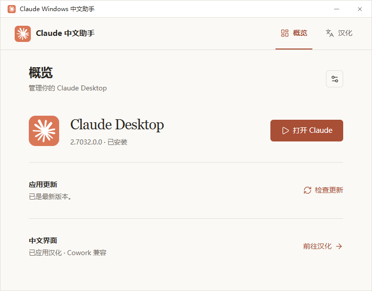
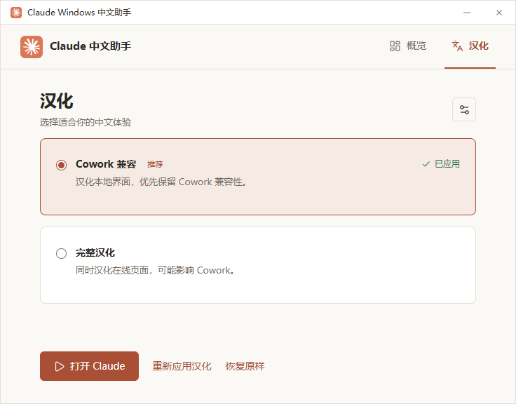
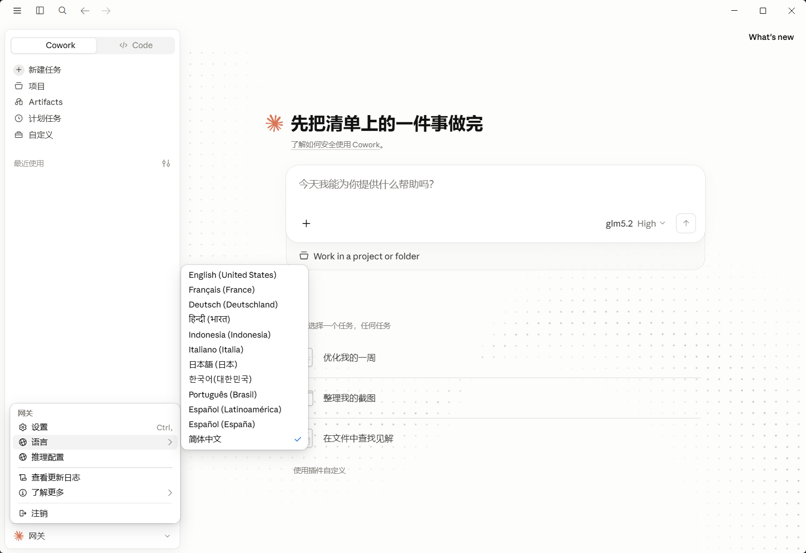
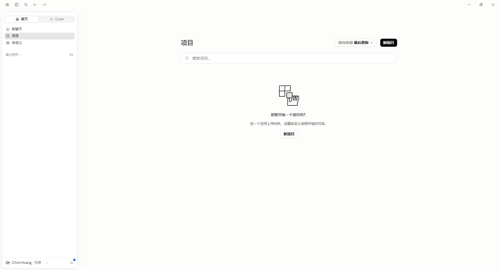
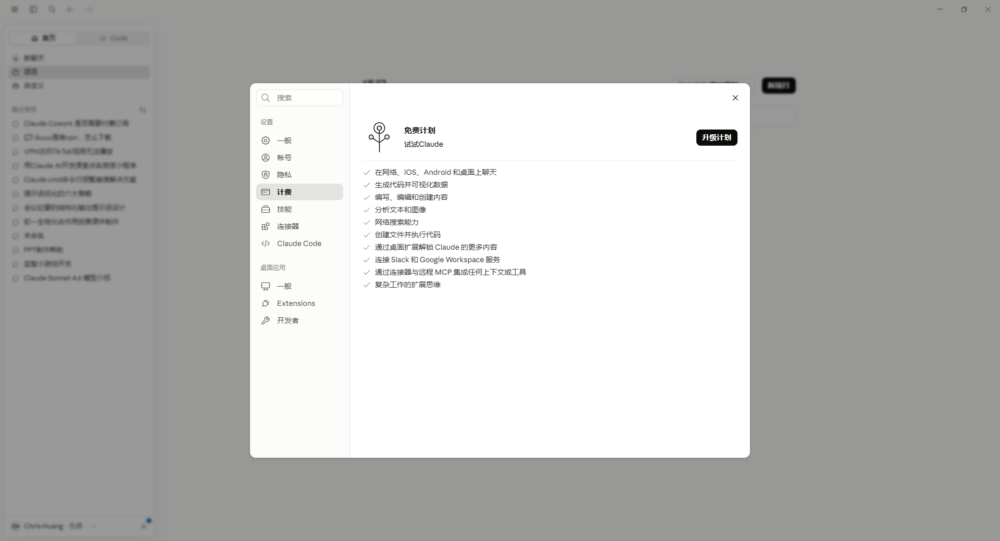
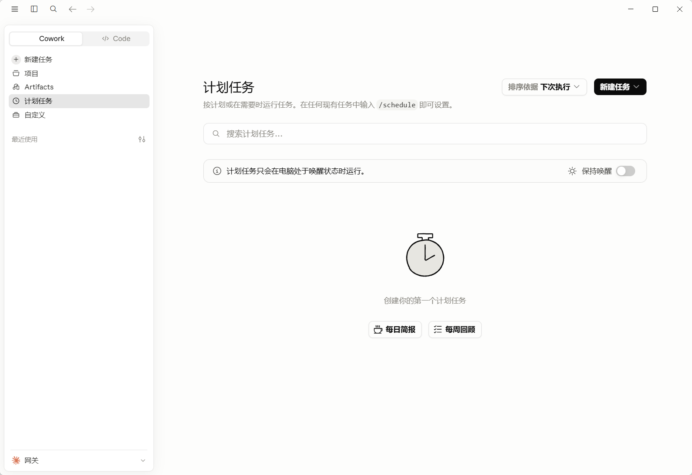
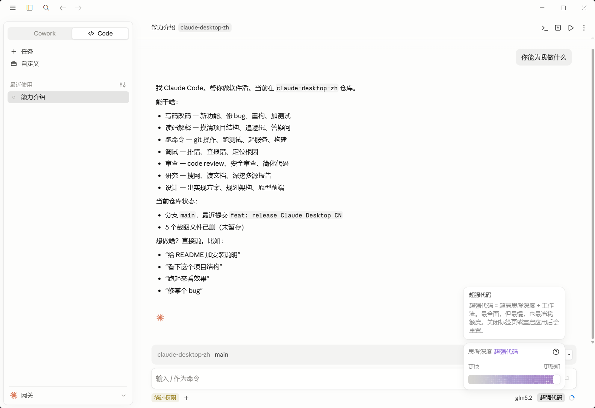
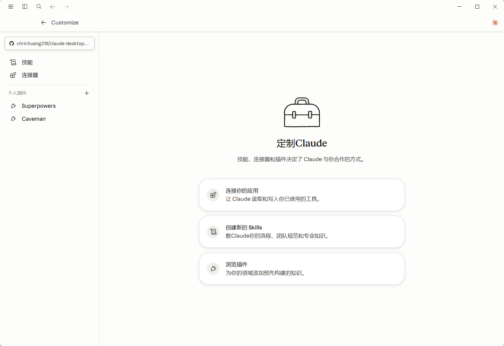

<div align="center">

# Claude 中文助手

**在 Windows 与 macOS 上管理官方 Claude Desktop，按需开启简体中文体验。**


[](LICENSE)

[下载助手](https://github.com/chrichuang218/claude-desktop-cn/releases/latest) · [界面预览](#界面预览) · [快速上手](#快速上手) · [反馈问题](https://github.com/chrichuang218/claude-desktop-cn/issues)

</div>

安装、更新、启动 Claude Desktop，以及应用或恢复汉化，都在一个小工具里完成。已有官方应用可以直接检测使用；汉化由你选择，更新后也不会自动重新应用。

> 本项目是第三方工具，与 Anthropic 没有从属关系。助手和 Claude Desktop 是两个独立应用，分别安装、更新和卸载。

> 仓库已更名为 `claude-desktop-cn`，v0.2.0 起仅使用新仓库更新源。0.1.x 用户请退出旧助手，用 v0.2.0 的 EXE 手动替换安装目录中的同名文件；原安装路径和配置继续保留。

> v0.2.0 提供 Windows 正式版和 **macOS 预览版**。Mac 双架构已通过原生 CI、自动测试和包内自检，功能实现与 Windows 对齐；真实 Claude 的安装、汉化恢复、权限和 Cowork 尚未完成交互验收。当前截图来自 Windows，具体范围见 [macOS 验收清单](docs/macos-acceptance.md)。

## 界面预览

### 概览 · 版本、更新与启动，一目了然



### 汉化 · 选择适合你的中文体验



### Claude Desktop · 汉化效果

具体汉化覆盖随 Claude 版本和所选模式变化。

**Cowork 首页与语言菜单**



**项目页面**



<details>
<summary>更多 Desktop 汉化效果</summary>

**计费设置**



**计划任务**



**Code 界面**



**自定义设置**



</details>

## 能做什么

- **管理官方应用**：检测已有 Claude Desktop，提供官方安装、更新与启动入口，下载包进行签名校验。
- **两种汉化方式**：侧重 Cowork 兼容，或覆盖更多在线页面；按需应用，也可恢复原样。
- **跟进上游汉化资源**：每次汉化或恢复前在线确认引擎修订，内容未变且缓存校验通过时直接复用，减少重复下载。
- **进度和日志可见**：执行过程中展示当前步骤、可用的下载进度与日志，失败时可复制日志排查。
- **按你的习惯安装**：助手支持便携、当前用户和系统安装；还可独立创建或修复 Claude Desktop 桌面快捷方式。
- **更新由你决定**：可在助手运行时每天检查 Claude 和助手的新版本，安装前由你确认。

## 选哪种汉化？

| 模式 | 汉化范围 | Cowork |
| --- | --- | --- |
| **Cowork 兼容 · 推荐** | 本地界面；在线页面覆盖有限 | 优先保留兼容性 |
| **完整汉化** | 本地界面，以及聊天、项目等在线页面 | 可能影响兼容性 |

日常使用 Cowork，建议先选兼容模式。翻译覆盖与兼容性取决于 Claude 版本和上游汉化引擎，不能保证所有页面都能汉化。

## 快速上手

1. 前往 [v0.2.0 Release](https://github.com/chrichuang218/claude-desktop-cn/releases/tag/v0.2.0)，按下表下载适合系统和芯片架构的包。macOS 附件为预览版；各包均配套同名 `.sha256` 摘要。
2. 启动助手，选择安装方式和位置。一般选 **用户安装**；**便携方式**默认在当前 EXE 或 `.app` 所在目录使用，不再复制程序。选择其他位置或用户/系统安装时，会保留原始下载文件；安装完成并退出后可删除原始文件，今后使用安装目录中的程序或快捷方式。macOS 用户安装默认为 `~/Applications`，系统安装默认为 `/Applications`，安装目录内的应用名称为 `Claude 中文助手.app`。
3. 在 **概览** 查看 Claude Desktop 状态。已安装则直接使用；未安装可通过助手下载安装。
4. 进入 **汉化**，选择模式并确认应用。需要恢复时，点击 **恢复原样**。

更新、汉化和恢复可能关闭 Claude Desktop，请先保存正在进行的工作；出现系统权限提示时，按实际操作确认。

| 平台 | 下载 | 状态与运行环境 |
| --- | --- | --- |
| Windows x64 | [claude-windows-cn.exe](https://github.com/chrichuang218/claude-desktop-cn/releases/download/v0.2.0/claude-windows-cn.exe) | 正式版；Windows、WebView2 Runtime |
| macOS Apple Silicon | [claude-cn-macos-arm64.app.tar.gz](https://github.com/chrichuang218/claude-desktop-cn/releases/download/v0.2.0/claude-cn-macos-arm64.app.tar.gz) | 预览版；macOS 13+ |
| macOS Intel | [claude-cn-macos-x64.app.tar.gz](https://github.com/chrichuang218/claude-desktop-cn/releases/download/v0.2.0/claude-cn-macos-x64.app.tar.gz) | 预览版；macOS 13+ |

macOS 解压后运行 `Claude 中文助手.app`。预览包使用 ad-hoc 本地签名，没有 Apple Developer ID 签名与公证；Gatekeeper 可能阻止首次打开或要求用户在系统设置中批准。Windows 暂不提供 ARM64 版；Cowork 的硬件与系统要求以官方为准。下载安装、更新检查、汉化与恢复需要联网。

macOS 的汉化和恢复还需要 **Python 3.9 或更新版本**，可通过 [python.org](https://www.python.org/downloads/macos/) 或 Homebrew 安装。助手会检查依赖，缺少时明确提示，不会自动安装 Python；Claude 的安装、更新与启动不需要 Python。

当前版本的验证范围与已知限制见 [更新日志](CHANGELOG.md#020---2026-09-26)。

## 常见问题

### 更新 Claude 后会自动汉化吗？

不会。更新后请在汉化页查看实际状态，按需重新应用。选中某个模式不代表已经应用，以页面的“已应用”状态为准。

### 恢复原样会删除聊天记录吗？

恢复针对当前 Claude 版本的原始应用文件，不删除个人数据。助手只使用能够验证、且属于当前版本的自有备份；缺少有效备份或发现其他工具的汉化资产时，会停止操作，不会强行覆盖。

### 卸载助手会卸载 Claude 吗？

不会。卸载助手保留 Claude Desktop 和个人数据，也不会自动恢复汉化。若希望移除汉化，请先在助手里执行“恢复原样”。

### 已经用过其他汉化工具，可以直接接着用吗？

助手不自动迁移旧工具的配置、缓存或备份。若检测到其他来源的汉化资源，请先使用原工具恢复，再用本助手操作。

### 遇到问题如何反馈？

在执行页复制日志，通过 [Issues](https://github.com/chrichuang218/claude-desktop-cn/issues) 提供系统版本、芯片架构、Claude 版本、汉化模式和复现步骤。发送前请检查日志中的用户名、路径等个人信息。

## 从源码运行

准备 Git、Node.js（20.19+ 的 20.x，或 22.12+）与 Rust。Windows 还需要 Microsoft C++ Build Tools 和 WebView2 Runtime；macOS 需要 Xcode Command Line Tools（`xcode-select --install`）。在对应系统执行：

```powershell
git clone https://github.com/chrichuang218/claude-desktop-cn.git
cd claude-desktop-cn
npm ci
npm run tauri dev
```

Windows 构建 EXE：

```powershell
npm run tauri build -- --no-bundle
```

产物：`src-tauri/target/release/claude-windows-cn.exe`。

macOS 构建应用（自动合并 `src-tauri/tauri.macos.conf.json`）：

```bash
APPLE_SIGNING_IDENTITY=- npm run tauri build -- --bundles app
```

产物：`src-tauri/target/release/bundle/macos/Claude 中文助手.app`。`--target aarch64-apple-darwin` 与 `--target x86_64-apple-darwin` 分别用于两个芯片架构，须先通过 `rustup target add` 安装目标。跨架构编译成功不能代替对应机器上的运行验收。

[CI 工作流](.github/workflows/ci.yml) 在 Windows、macOS Apple Silicon 和 macOS Intel runner 上执行检查、测试、打包、自检和摘要生成，并保存构建附件；不会自动创建 GitHub Release。

仅预览界面可运行 `npm run dev`；应用管理和汉化功能需要 Tauri 桌面程序。

<details>
<summary>开发检查命令</summary>

```powershell
npm run lint
npm run build
cargo fmt --check --manifest-path src-tauri/Cargo.toml
cargo test --manifest-path src-tauri/Cargo.toml
cargo check --manifest-path src-tauri/Cargo.toml
```

</details>

## 支持项目

如果这个小工具让你使用 Claude 更方便，欢迎点一个 **Star ⭐**，也欢迎通过 Issue 分享问题和建议。

想参与开发？请阅读 [贡献指南](CONTRIBUTING.md)。

## 致谢

🙏 感谢 [LINUX DO](https://linux.do/) 社区的支持与讨论。

感谢 [javaht/claude-desktop-zh-cn](https://github.com/javaht/claude-desktop-zh-cn)。本项目的汉化引擎与语言资源来自该项目。

## 来源与许可

官方应用管理能力参考 `claude-desktop-windows-updater`，助手更新校验流程参考 `codex-windows-cn`。相关上游代码、资源和商标遵循各自的许可与权利声明，详见 [第三方声明](THIRD_PARTY_NOTICES.md)。

本项目采用 [MIT 许可证](LICENSE)。「Claude」是 Anthropic 的商标。
